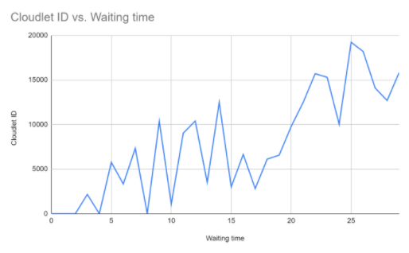
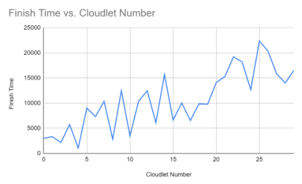
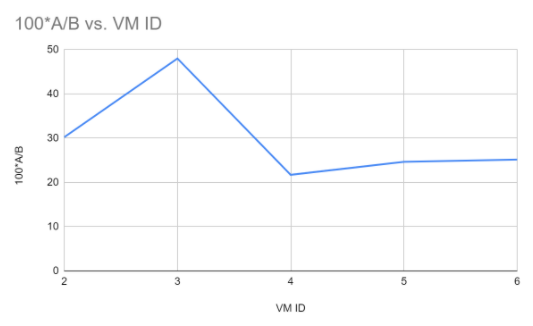

# CloudSim-FCFS-Scheduling

Components:

1. Regions - Models geographical regions in which cloud service providers allocate resources to their customers. In cloud analysis, there are six regions that correspond to six continents.
2. Data Centres - It models the infrastructure services provided by various cloud service providers. It encapsulates a set of computing hosts
3. Data Centre Characteristics - It models information regarding data centre resource configurations.
4. Hosts - It models physical resources (compute or storage)
5. The user base - It models a group of users considered as a single unit in the simulation, and its main responsibility is to generate traffic for the simulation.
6. Cloudlet - It specifies the set of user requests. It contains application ID, name of the user base as well as the size of request execution commands, and input and output files.
7. Service broker - The service broker decides which data centre should be selected to provide the services to the requests from user base.
8. VMM Allocation Policy - It models provisioning policies on how to allocate VMs to hosts.
9. VM Scheduler - It models the time or space shared, scheduling a policy to allocate to processor cores to VMs.

